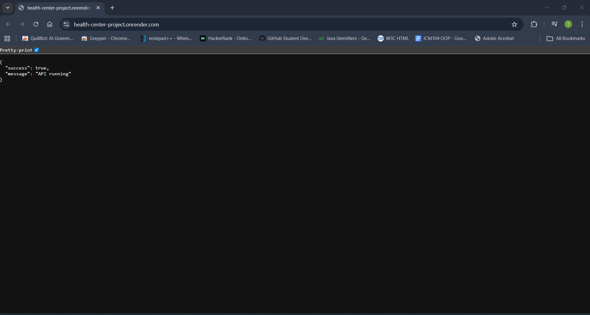
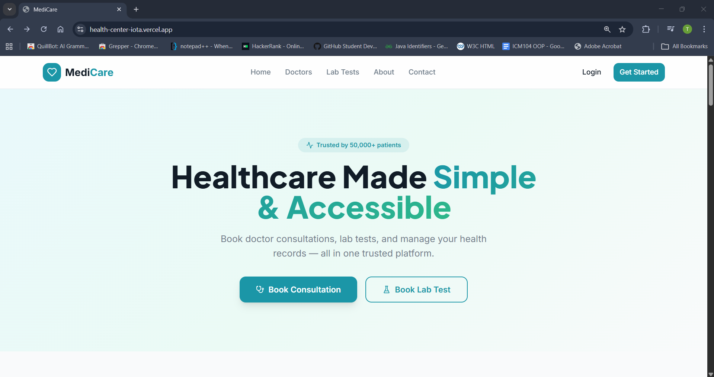
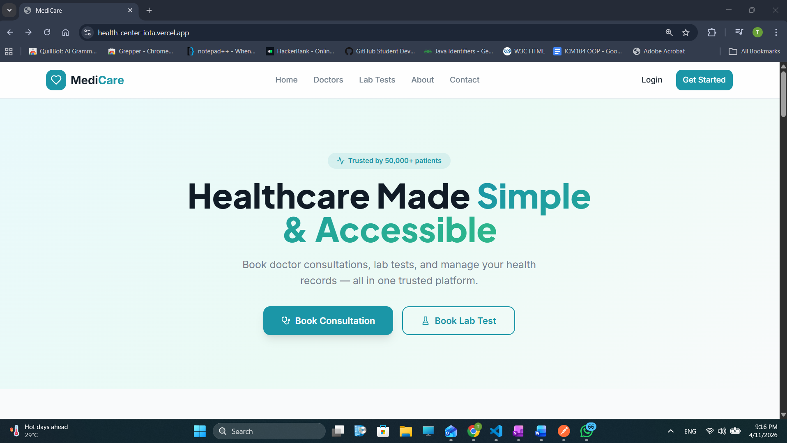

# Health Center — Full Stack Application

Comprehensive full-stack healthcare management system providing appointment booking, patient management, pharmacy orders, diagnostic tests, and role-based administration.

This repository contains a Node.js (Express) REST API backend and a React frontend (Vite).

---

## Table of Contents

- [Project Overview](#project-overview)
- [Tech Stack](#tech-stack)
- [System Architecture](#system-architecture)
- [Setup Instructions](#setup-instructions)
- [API Documentation](#api-documentation)
- [Deployment Details](#deployment-details)
- [Testing Instructions](#testing-instructions-summary)


---

## Project Overview

Health Center is a domain-specific healthcare management application designed to support multiple user roles (patients, doctors, lab technicians, pharmacists, and administrators). It provides:

- Appointment scheduling and slot management
- Patient registration and profile management
- Doctor availability and channeling
- Pharmacy inventory and order processing
- Diagnostic test requests and results
- Role-based access control and administrative tools
- Integration with third-party services (e.g., payment gateways, SMS/email providers, external health APIs)

Key capabilities include CRUD operations for all core resources, JWT-based authentication, role-aware authorization, server-side validation and error handling, pagination/filtering/search, backend unit + integration tests (Jest + Supertest), and frontend component tests (React Testing Library).

## Tech Stack

- **Backend:** Node.js, Express.js, MongoDB (Mongoose)
- **Frontend:** React 18 (Vite), Tailwind CSS, Shadcn/Radix UI, React Router v6
- **Authentication:** JSON Web Tokens (JWT) + Express sessions (connect-mongo)
- **Testing:** Jest + Supertest + mongodb-memory-server (backend); Jest + React Testing Library (frontend)
- **Dev tooling:** Nodemon, Vite, ESLint
- **API docs:** Postman collection at `server/postman/HealthCenter.postman_collection.json`

## System Architecture

**Backend**

- `routes/`: Express route definitions grouped by resource (auth, users, appointments, pharmacy, lab, admin).
- `controllers/`: Controllers that parse requests, call services, and return responses.
- `services/`: Business logic and orchestration (database calls, third-party API calls).
- `models/`: Mongoose models and schemas for Users, Appointments, Medications, Tests, etc.
- `middlewares/`: Authentication (JWT verification), authorization (role checks), validation, and error handling.
- `utils/`: Helper functions (pagination, response formatting, logger).

Request flow: routes -> controllers -> services -> models -> DB. Middlewares run at the route level for auth and validation.

**Frontend**

- `src/components/`: Reusable UI pieces (Navbar, AppointmentCard, DoctorCard, SlotPicker, StatusBadge).
- `src/pages/`: Route-specific pages (public, user, doctor, admin, pharmacy, lab).
- `src/contexts/`: Context providers for auth and app state (AuthContext, UserAppContext, CenterAdminContext, etc.).
- `src/lib/`: API client wrappers and utility functions.
- `src/services/`: Client-side services that call backend endpoints.

Data flow: UI components dispatch actions / call context methods -> context updates state -> components re-render. API calls use `fetch`/`axios` to talk to backend endpoints.

Frontend ↔ Backend communication: RESTful JSON APIs secured with JWT tokens sent in the `Authorization: Bearer <token>` header.

## Setup Instructions

Follow the steps below to run the project locally.

1. Clone the repository

```bash
git clone https://github.com/Marco03Fernando/Health-Center.git
cd health-center
```

2. Backend setup

```bash
cd server
npm install
# copy or create .env (see .env.example)
```

Environment variables (create a `.env` in `server/`, do **not** commit secrets):

- `MONGO_URI` — MongoDB Atlas connection string
- `JWT_SECRET` — JWT signing secret
- `SESSION_SECRET` — Express session secret
- `PORT` — Backend port (defaults to **8081**)
- `CLIENT_URL` — Frontend origin for CORS (e.g., `http://localhost:5173`)

Run backend (development):

```bash
npm run dev
# or
node src/server.js
```

3. Frontend setup

```bash
cd ../client
npm install
# copy .env.local if needed
npm run dev
```

Open the frontend in the browser (Vite dev): http://localhost:8080

## API Documentation

- Server API documentation (detailed module READMEs):
	- [Pharmacy API](server/docs/pharmacy_api_README.md)
	- [Appointment API](server/docs/appointment_api_README.md)
	- [Doctor Channeling API](server/docs/doctor_channeling_api_README.md)
	- [Test Management API](server/docs/test_management_api_README.md)
	- [Auth API](server/docs/auth_api_README.md)

Postman collection (import into Postman or run with Newman):
- [HealthCenter.postman_collection.json](server/postman/HealthCenter.postman_collection.json)

Quick import / run (optional):

```bash
# Import in Postman UI or run with Newman
npx newman run server/postman/HealthCenter.postman_collection.json
```

Authentication: All protected endpoints require an `Authorization` header with a valid JWT: `Authorization: Bearer <token>`.


Representative API endpoints and full reference are maintained in the server docs and the included Postman collection. See the links above under "API docs & Postman collection" for the complete per-module reference and runnable examples.

## Deployment Details

Backend
- Render

Backend setup 
1. Create a new Node.js service on the chosen platform.
2. Connect a Git repository or enable Deploy from GitHub.
3. Set the start command: `npm start` (use `npm run dev` only for development deployments).
4. Add environment variables in the platform dashboard (see list below).
5. Provision a MongoDB instance (Atlas or hosted) and set `MONGO_URI` to point to it.
6. Deploy and verify logs; ensure the API responds at the assigned domain.

Frontend
- Vercel 

Frontend setup 
1. Create a new project on Vercel and connect the `client/` folder repository (or point to root and set `client` as the build directory).
2. Set the build command: `npm run build` and the output directory: `dist` (Vite default).
3. Add environment variables (see list) such as `VITE_API_BASE_URL` pointing to the backend API base URL.
4. Deploy and verify the site loads and communicates with the backend.

Environment variables

| Variable | Used by | Notes |
|----------|---------|-------|
| `MONGO_URI` | `server/src/config/db.js` | MongoDB Atlas URI |
| `JWT_SECRET` | `src/middlewares/auth.middleware.js` | JWT signing secret |
| `SESSION_SECRET` | `src/server.js` | Express session secret |
| `PORT` | `src/server.js` | Defaults to 8081 |
| `CLIENT_URL` | `src/server.js` (CORS) | Deployed frontend origin |
| `VITE_API_URL` | `client/src/config/api.ts` | Backend base URL for the frontend |

Live URLs
- Backend API: https://api.health-center.example.com (example placeholder)
- Frontend: https://health-center-iota.vercel.app

Deployment evidence and screenshots


### Backend console


### Deployed frontend screenshot


### Build / deploy logs



## Testing Instructions (summary)

We wrote tests for both the backend and the frontend.

**Backend integration tests** — run from the `server/` folder:

```bash
cd server
npm install
npm test
```

The backend has two layers of tests, both picked up by `npm test`:
- **Unit tests** colocated in `server/src/` (controllers and routes) — each test mocks all external dependencies and tests one module in isolation. 27 test files covering all controllers and route handlers across appointments, auth, doctor channeling, pharmacy, and test management.
- **Integration tests** in `server/tests/` — spin up an in-memory MongoDB replica set and hit real Express routes via Supertest end-to-end. 4 test files covering appointment booking/slots, diagnostic tests, medication inventory, and pharmacy orders.

Results: **31 suites, 317 tests — all passing**.

To generate an HTML coverage report:

```bash
npm run test:coverage
# open server/coverage/index.html in a browser
```

**Frontend** — run from the `client/` folder:

```bash
cd client
npm install
npm test
```

Frontend tests are colocated with their source files and use Jest + React Testing Library. We cover all components, UI primitives, pages (all roles), layouts, routes, hooks, and lib utilities — **127 suites, 132 tests — all passing**.

Full testing details: [docs/TESTING_INSTRUCTIONS.md](docs/TESTING_INSTRUCTIONS.md)

### Coverage reports

- Backend: [server/coverage/index.html](server/coverage/index.html) (generated with `npm run test:coverage` in `server/`)
- Frontend: run `npm test` in `client/` — all 132 tests pass


